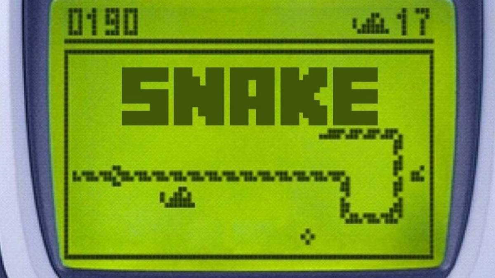

# _The Classic Snake Game_

Over time, one of the games that has been played the most (and continues to
be played) from generation to generation is the _Snake_, whether from a _GameBoy_
or from a next-generation console.



## Let's talk a little about his story...

The _Snake_ is a video game released in the _mid-1970s_ that has maintained its
popularity ever since, becoming a classic. In _1998_, _Snake_ gained a massive
audience after becoming a standard pre-recorded game on _Nokia_ phones.

**Taneli Armanto was the creator of this game**, and, the last decade, he announced
the return of the game loaded with multiple improvements, such as new graphics,
which include going back in time after colliding Lightning bolts that help to
capture fruits more quickly... In the same way, they incorporate a 'fruit store'
where we will get more levels and new objects that can be obtained by paying with
the fruits collected or through real money, which amounts to _In-App purchases_.

---

We, _the UMU team_, being nothing more than inexperienced programmers (for now),
have developed a simpler version, but we are proud of it.

This first version of our game, despite being very simple, has meant a great
technical effort on our part, quite a challenge since we could not use the basics
we know about object-oriented programming.

## Technical aspects

To develop this video game we have opted for a basic modular
architecture. Not being able to use object-oriented programming, as
already mentioned, we have been forced to handle a global 'state' for
the different types of entities in the program.

That is, globalize all those properties of our snake, the snake's
food, and the application itself (score, difficulty...)

In addition, every good programmer must be clean and readable, so
instead of putting all our code in a single module, we have cut all
the most significant segments into 'helper' methods, located in the
'scripts' file.

We must also comment that in order not to leave 'row' texts or
'loose' numerical values, we have used the 'utility' pattern
(constants module).

> Functional programming is very powerful, and is applied as the
> preferred paradigm by many developers of languages ​​such as
> _JavaScript_ (ramda), _Python_, and various frameworks such as
> _React_, with their _Functional Components_.
>
> With it, what we achieve is to reduce the complexity of our code,
> dividing it into atomic and representative segments, which only and
> exclusively perform an action, as we see in mathematical functions.
> **Divide and Conquer**

Finally, it should be noted that in the code documentation process we
have used the same pattern and tags that we find in documentation
technologies such as _'jsdoc'_ or _'javadoc'_, including a draft in
_'Markdown'_ format, which gives it a little touch of professionalism
to our project.

---

## Hands on code

In order to explain the execution cycle of our program, focusing on the
basic aspects, given the simplicity of the algorithm, we will go file by
file explaining the most important parts.

### 1. `settings.py`

In this module we have simulated a global context, which acts as the
provider and only source of truth for the rest of the files.

Its content is as follows:

```python
from utils.constants import INITIAL_DIFFICULTY
from utils.constants import INITIAL_SCORE
from utils.constants import INITIAL_SNAKE_POSITION
from utils.constants import INITIAL_SNAKE_BODY
from utils.constants import INITIAL_SNAKE_DIRECTION
from utils.constants import INITIAL_FOOD_POSITION

global game_window
global fps_controller
global difficulty
global score
global snake_pos
global snake_body
global snake_direction
global new_snake_direction
global food_spawn  # flag
global food_pos

difficulty = INITIAL_DIFFICULTY
score = INITIAL_SCORE
snake_pos = INITIAL_SNAKE_POSITION
snake_body = INITIAL_SNAKE_BODY
snake_direction = INITIAL_SNAKE_DIRECTION
new_snake_direction = snake_direction
food_spawn = True
food_pos = INITIAL_FOOD_POSITION

```

> _Note_: we have not initialized the global variables `game_window` and
> `fps_controller`, since a call to the PyGame module is required
> after a possible _error capture_, which we carry out in our scripts.

---

### 2. `constants.py`

As we have already mentioned, all the constants of our application have
been moved to a 'utility module'. Its content is as follows:

```python
from random import randrange
from pygame import Color

WINDOW_WIDTH = 720
WINDOW_HEIGHT = 480
BLACK = Color(0, 0, 0)
WHITE = Color(255, 255, 255)
GREEN = Color(0, 255, 0)
UP = "UP"
DOWN = "DOWN"
LEFT = "LEFT"
RIGHT = "RIGHT"
GAME_TITLE = "Snake Classic"
GAME_OVER_TXT = "Game Over"
SCORE_TXT = "Score: "
PIXELS_PER_MOVE = 10
FOOD_SIZE = 10
SNAKE_MIN_SIZE = FOOD_SIZE
INITIAL_DIFFICULTY = 25
MAX_RECOMMENDED_DIFFICULTY = 100
INITIAL_SCORE = 0
INITIAL_SNAKE_DIRECTION = RIGHT
INITIAL_SNAKE_POSITION = [100, 50]
INITIAL_SNAKE_BODY = [
    INITIAL_SNAKE_POSITION.copy(),  # important!
    [INITIAL_SNAKE_POSITION[0] - PIXELS_PER_MOVE, INITIAL_SNAKE_POSITION[1]],
    [100 - (2 * 10), 50],
]
INITIAL_FOOD_POSITION = [
    randrange(1, (WINDOW_WIDTH // FOOD_SIZE)) * FOOD_SIZE,
    randrange(1, (WINDOW_HEIGHT // FOOD_SIZE)) * FOOD_SIZE,
]

```

With these alphanumeric values ​​and data structures, our program solves all scenarios.

[Here](https://stackoverflow.com/questions/19620498/how-to-create-a-utility-class-correctly)
you can read more about this pattern in the `Python` language.

---

### 3. The `assets` folder

There is not much to say about the content of this folder, as it is representative
enough. Basically, inside it **we are storing the different types of media that our
program uses.**

---

### 4. `script.py`

This is the heaviest module of our application, as it contains all kinds of atomic
helper functions that implement the main logic of our algorithm.

Given the delicacy that must be taken when documenting the project, we have decided to
go function by function, commenting on the key aspects.

1.  The `init_game()` method initializes the game, creating the screen and the FPS
    controller.

    ```python
    def init_game():
        errors = pygame.init()

        if errors[1]:
            print(f"[!] Had {errors[1]} errors, exiting...")
            sys.exit(-1)

        # Initialize the game window
        pygame.display.set_caption(GAME_TITLE)
        settings.game_window = pygame.display.set_mode(
            (WINDOW_WIDTH, WINDOW_HEIGHT)
        )

        # FPS (frames per second) controller
        settings.fps_controller = pygame.time.Clock()

        # Play the background music
        play_music("assets/audios/bg-music.mp3", True)
    ```

    The first line of this function is the attempt to initialize the pygame library. In
    case of error we forcefully break the flow of our program. On the other hand, if the
    initialization is successful:

    - We create the game window.
    - Initialize our global `fps_controller` (a Clock).
    - Play a background music in order to improve the UX.

2.  The Snake's `direction_manager()` handles all the keyboard press events,
    calculating the new Snake's direction.

    ```python
    def direction_manager():
        for event in pygame.event.get():
            if event.type == pygame.QUIT:
                quit()
            elif event.type == pygame.KEYDOWN:
                if event.key == pygame.K_UP or event.key == ord("w"):
                    settings.new_snake_direction = UP
                elif event.key == pygame.K_DOWN or event.key == ord("s"):
                    settings.new_snake_direction = DOWN
                elif event.key == pygame.K_LEFT or event.key == ord("a"):
                    settings.new_snake_direction = LEFT
                elif event.key == pygame.K_RIGHT or event.key == ord("d"):
                    settings.new_snake_direction = RIGHT
                elif event.key == pygame.K_ESCAPE:  # Exit
                    pygame.event.post(pygame.event.Event(pygame.QUIT))

        # Correct the new direction
        fix_snake_direction()
    ```

    Depending on the pressed key, we will give one value or another to the **new direction**
    of the _Snake_ in the next render.

    - If the user presses the _up_ or _w_ keys, the next Snake's direction will be set to `UP`.
    - If the user presses the _down_ or _s_ keys, the next Snake's direction will be set to `DOWN`.
    - If the user presses the _left_ or _a_ keys, the next Snake's direction will be set to `LEFT`.
    - If the user presses the _right_ or _d_ keys, the next Snake's direction will be set to `RIGHT`.

    > _Note_: The game will close if the user presses the 'escape' key.

3.  But this shouldn't always be the case, there are some _special cases_ to deal with, inside the
    `fix_snake_direction()` method.

    ```python
    def fix_snake_direction():
        if settings.new_snake_direction == UP and settings.snake_direction != DOWN:
            settings.snake_direction = settings.new_snake_direction
        elif settings.new_snake_direction == DOWN and settings.snake_direction != UP:
            settings.snake_direction = settings.new_snake_direction
        elif settings.new_snake_direction == LEFT and settings.snake_direction != RIGHT:
            settings.snake_direction = settings.new_snake_direction
        elif settings.new_snake_direction == RIGHT and settings.snake_direction != LEFT:
            settings.snake_direction = settings.new_snake_direction
    ```

    As you can see, **we will only apply the new direction to the snake if and only if it is not
    the opposite of it** _(i.e. up/down, left/right...)_

4.  The `move_snake()`method changes the Snake's position, based on its direction and the given
    number of pixels. There is not much to say about this function, since its logic is comparable to
    that of a mathematical axis.

    ```python
    def move_snake(pixels=PIXELS_PER_MOVE):
        # Y-AXIS
        if settings.snake_direction == UP:
            settings.snake_pos[1] -= pixels
        elif settings.snake_direction == DOWN:
            settings.snake_pos[1] += pixels

        # X-AXIS
        elif settings.snake_direction == LEFT:
            settings.snake_pos[0] -= pixels
        elif settings.snake_direction == RIGHT:
            settings.snake_pos[0] += pixels
    ```

5.  The `eat_food()` implementation determines whether the food should be eaten or not,
    growing the Snake's body and incrementing the score and the game difficulty accordingly.

    ```python
    def eat_food():
        settings.snake_body.insert(0, list(settings.snake_pos))  # optimistic

        if (
            settings.snake_pos[0] == settings.food_pos[0]
            and settings.snake_pos[1] == settings.food_pos[1]
        ):
            settings.score += 1

            difficulty_increment = randint(1, 2)
            if settings.difficulty + difficulty_increment \
                    <= MAX_RECOMMENDED_DIFFICULTY:
                settings.difficulty += difficulty_increment

            settings.food_spawn = False
        else:
            settings.snake_body.pop()
    ```

    > The difficulty increase is not something that we found in the first version of
    > the original game... But we liked the idea of ​​making the game a little more
    > difficult, with a touch of randomness, as we go along. **It sounds really original!**
    >
    > Also, note that we have not implemented an optional argument parse by the client
    > (console) when initializing the game... But, specifically in these lines, we have
    > thought of giving the developers an opportunity to increase the initial difficulty
    > of the game above the recommended one, directly manipulating the constants file,
    > without leaving the game hanging or making it too impossible, avoiding increasing
    > the difficulty if it is already exaggerated enough.

6.  The `respawn_food()` function

    ```python
    def respawn_food():
        if not settings.food_spawn:
            settings.food_pos = [
                randrange(1, (WINDOW_WIDTH // FOOD_SIZE)) * FOOD_SIZE,
                randrange(1, (WINDOW_HEIGHT // FOOD_SIZE)) * FOOD_SIZE,
            ]

        settings.food_spawn = True

    ```

    respawns the Snake's food in the map if it is not present in the current render.
    As you can see, in order not to go outside the limits of the map, **we have been very
    precise when calculating the random range.**

7.  Calling `game_over()` we can easily change the state of our application to _Game Over_,
    playing a custom sound effect and exiting the game after a minimal **sleep**.

    ```python
    def game_over():
        # Play the `Game Over` audio
        play_music("assets/audios/game-over.mp3")

        # Update the UI
        my_font = pygame.font.SysFont("times new roman", 90)
        game_over_surface = my_font.render(GAME_OVER_TXT, True, GREEN)
        game_over_rect = game_over_surface.get_rect()
        game_over_rect.midtop = (WINDOW_WIDTH / 2, WINDOW_HEIGHT / 4)
        settings.game_window.fill(BLACK)
        settings.game_window.blit(game_over_surface, game_over_rect)
        display_score(2, GREEN, "times")
        pygame.display.flip()

        # Exit the game after 5 secs
        time.sleep(5)
        quit()
    ```

8.  To update the user interface, we make use of various 'drawers' helper methods. These
    are nothing more than functions that use the PyGame library to plot elements on the screen.
    It is not worth going into detail, it is not complex and can be understood on first reading.

    - `display_score()`
    - `draw_snake()`
    - `draw_food()`
    - `update_gui()`
    - `clear_screen()`

9.  Handling edgy cases...

    - `handle_out_of_boundaries()`: When the Snake touches the sides of the map... **Game Over**!

      ```python
      def handle_out_of_boundaries():
          if (
              settings.snake_pos[0] < 0
              or settings.snake_pos[0] > WINDOW_WIDTH - SNAKE_MIN_SIZE
          ):
              game_over()

          if (
              settings.snake_pos[1] < 0
              or settings.snake_pos[1] > WINDOW_HEIGHT - SNAKE_MIN_SIZE
          ):
              game_over()
      ```

    - `handle_body_touches()` when the Snake touches itself... it is **Game Over** too!

      ```python
      def handle_body_touches():
          for block in settings.snake_body[1:]:
              if settings.snake_pos[0] == block[0] and settings.snake_pos[1] == block[1]:
                  game_over()
      ```

10. With the `play_music()` method we can play any sounds providing an URI. Also, **we can
    specify if the PyGame's mixer should play the audio in a loop or not.**

    ```python
    def play_music(uri, loop=False):
        pygame.mixer.init()
        pygame.mixer.music.load(uri)
        pygame.mixer.music.play(-1 if loop else 0)
    ```

11. Finally, the `quit()` function provides us the possibility to end the game.

    ```python
    def quit():
        pygame.quit()
        sys.exit()
    ```

---

Finally, **we have reached a clean architecture!** It is time to give some life to our
algorithm and comunicate each part of our system!


### 5. `__main_.py`

`__main__.py` **is the name of the environment where top-level code is run**. _Top-level code_ is the
first user-specified `Python` module that starts running. It’s _top-level_ because it imports all other
modules that the program needs. Sometimes `top-level code` is called an **entry point** to the application.

```python
import settings
from script import init_game
from script import direction_manager
from script import move_snake
from script import eat_food
from script import respawn_food
from script import update_gui

def main():
init_game()

    while True:
        # Calculate the new direction (based on hooks)
        direction_manager()

        # Moving the Snake
        move_snake()

        # Snake body growing
        eat_food()

        # Respawn food
        respawn_food()

        # Update the GUI
        update_gui()

        # Clock tick
        settings.fps_controller.tick(settings.difficulty)

if **name** == "**main**":
    main()

```

> Thanks to functional programming and the various refactorings and patterns used, our main module
> is that simple.
